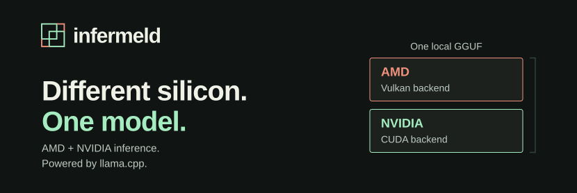
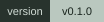
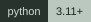

# Infermeld

<p align="center">
<picture>
  <source media="(max-width: 600px)" srcset="assets/infermeld-banner-compact.svg">
  
</picture>
</p>

[](#evidence-not-promises)
[](https://github.com/5p00kyy/infermeld/actions/workflows/checks.yml)
[](https://github.com/5p00kyy/infermeld/releases/tag/v0.1.0)
[](#prerequisites)
[](#prerequisites)
[](LICENSE)

**One local GGUF. Two explicitly selected GPUs.** Infermeld is a small Linux companion kit for running a separately built llama.cpp across AMD Vulkan and NVIDIA CUDA devices. It adds read-only preflight checks, an inspectable launch command and guarded foreground serving. No Python dependencies beyond the standard library.

[Quick start](#quick-start) · [Build the engine](BUILD.md) · [Evidence](docs/EVIDENCE.md) · [Troubleshooting](docs/TROUBLESHOOTING.md) · [Contributing](CONTRIBUTING.md) · [Experiment site](https://5p00kyy.github.io/infermeld/)

**Experimental v0.1.0.** This is a source-only experimental release, not an installer or a universally qualified hardware preset. The live source-check badge covers CPU-only tests and bundle contracts. Hardware acceptance and source CI are separate.

## Why use Infermeld?

You already have an AMD card and an NVIDIA card, and want to investigate a model that needs both. Infermeld keeps the important choices explicit: which physical devices, what layer split, how much context, whether to enable MTP, and which server process it is allowed to stop. The retained results make the tested artifacts and the failed attempts inspectable.

Mixed-vendor inference itself is llama.cpp's capability. Infermeld does not pool VRAM into a single memory space or invent a faster engine. Its value is a smaller, reproducible and guarded way to use that capability.

### When not to use it

- Your model already runs well on one GPU and you only want a speed upgrade. Mixed-device serving is not a guaranteed speedup.
- You need automatic installation, Windows/macOS support, scheduling, multi-user serving or a managed service. This kit does not supply those.
- You need proven 128K recall or sustained Q4 throughput. Neither is established by the retained checks.
- You cannot provide a readable AMD junction sensor. The current guard fails closed rather than running unmonitored.

## What works now

- List devices through your selected `llama-server` binary.
- Construct an explicit two-device layer-split launch and inspect it without executing it.
- Serve on `127.0.0.1` only, with a single slot and explicit context/microbatch settings.
- Keep speculative decoding off by default; opt into native MTP explicitly.
- Monitor an AMD junction sensor read-only. A hot or unreadable sensor fails closed.
- Terminate and reap only the server process group this invocation owns, including on thermal trip and normal termination signals.

The kit uses Python 3.11 or newer, with no dependencies beyond Python's standard library. Linux is required for the current process-group and sensor implementation. The wrapper does not build/download llama.cpp, fetch weights, change fans/power/clocks, alter drivers, or install a persistent service.

## Prerequisites

Use an already-built compatible native CUDA + Vulkan `llama-server` and a locally verified GGUF. The current live acceptance used upstream llama.cpp revision `b92761a515ea31e852e7fbc1fad5f874b46f3718`. Compatibility with arbitrary other revisions is not established.

Make the matching CUDA runtime libraries available to that binary if your toolkit is isolated. The wrapper preserves `LD_LIBRARY_PATH`, but does not discover or install a toolkit for you.

The pinned CUDA + Vulkan build recipe is in [BUILD.md](BUILD.md). Before loading weights, run `preflight.py` with an explicit trusted binary and device pair. It checks runtime libraries, required flags and device inventory without starting a model or listener. Physical-GPU identity still requires your confirmation.

Ensure both GPUs are available for your workload. Device IDs describe a backend, not necessarily a physical vendor: Vulkan can expose the NVIDIA card too. Never infer the vendor or available memory from an index alone. The wrapper is not a scheduler and does not reserve GPUs against other applications.

The CLI checks only the GGUF magic, not the complete format or content hash. Verify the pinned artifact's SHA-256 independently before running it.

## Quick start

Replace these example paths with your existing binary and verified local model. First inspect device identities:

```sh
python3 infermeld.py devices --server ./llama.cpp/build/bin/llama-server
```

After confirming that `Vulkan0` and `CUDA0` are the intended two different physical GPUs, inspect the proposed launch:

```sh
python3 infermeld.py serve \
  --server ./llama.cpp/build/bin/llama-server \
  --model ./models/model.gguf \
  --devices Vulkan0,CUDA0 --split 3,2 --confirm-devices \
  --ctx-size 8192 --ubatch 32 --dry-run
```

`--dry-run` emits a JSON argument array without starting the server. Remove `--dry-run` to run the same command. The OpenAI-compatible API listens on loopback port 8080 by default; choose a different free port with `--port`. Once the model is ready, check `http://127.0.0.1:8080/health` and `http://127.0.0.1:8080/v1/models`. Ctrl+C stops this invocation's server.

Optional native MTP uses `--mtp 4`. It requires a compatible model with its MTP data and additional memory. It is not silently enabled or assumed safe merely because ordinary serving fits.

This initial wrapper always uses layer splitting, q8_0 target caches, explicit Flash Attention, one slot and `--fit off`. MTP also explicitly uses q8_0 draft caches. These are visible starting choices, not a claim that they fit every model/device pair or are optimal. Explicit device and split arguments are required; no physical GPU order is assumed.

## Thermal and shutdown contract

The default junction trip is 85°C, sampled every 0.1s. It is a software watchdog, **not a hard temperature ceiling**; an in-flight workload and sensor/termination latency can overshoot. `--trip-c` can lower this trip, not raise it above 85°C in this candidate.

One labeled AMD junction sensor is discovered automatically. With multiple AMD GPUs or a nonstandard layout, specify the correct read-only path with `--junction-sensor`. A missing or unreadable sensor prevents startup or stops the owned server. The wrapper does not monitor every GPU's every thermal sensor and is not a replacement for adequate hardware cooling or driver protections.

Ctrl+C or SIGTERM stops the owned server. No unrelated listener is terminated to obtain the port. Configuration/occupied-port errors return 2; guard or launch failures return 74; a thermal trip returns 75. Handled termination signals return 128 plus the signal number, for example 143 for SIGTERM. An ordinary server failure is propagated, so exit 2 can also come from the selected binary.

For reproducibility, inherited `LLAMA_ARG_*`, `GGML_*` and `LLAMA_MTP_*` override variables are removed from the server environment. Other environment values are not printed or rewritten.

## Evidence, not promises

Private hardware acceptance has exercised this CLI with a pinned Qwen3.6-35B-A3B UD-Q4_K_M on RX 6900 XT 16 GB + RTX 3080 10 GB, at an 8K reservation, 3:2 layer split and microbatch 32. Default non-MTP and explicit MTP4 each passed four short exact/JSON/retrieval/prose sanity checks, preserved the existing GPU-control configuration, and shut down their owned server. The [sanitized fresh-build acceptance record](site/cli-acceptance.json) binds these results to the unchanged CLI, exact model and engine-library cohort. These checks do not prove broad answer quality or sustained throughput.

Separate investigation scripts verified Q4 allocation and short serving up to 128K. That is **not** full-length 128K prompt ingestion or retrieval quality. These results are not automatic defaults for this wrapper. Read [the evidence guide](docs/EVIDENCE.md) before treating an allocation, short answer or historical speed as a broader result.

Full-prompt qualification for both Q4 models remains incomplete because the reference machine's cooling constrained longer trials. Detailed cooling diagnostics stay in private receipts. Aborted runs supply no performance numbers, and the wrapper never applies temporary fan or power controls. Neither model's maximum usable context has been established; 8K is not a measured optimum and 128K remains allocation-only evidence.

## Repository map

| File or directory | Purpose |
|---|---|
| `infermeld.py` | Foreground device listing and guarded serving |
| `preflight.py` | Read-only engine, runtime and device checks |
| [BUILD.md](BUILD.md) | Pinned CUDA + Vulkan build instructions |
| [docs/EVIDENCE.md](docs/EVIDENCE.md) | What the retained results do and do not establish |
| [docs/TROUBLESHOOTING.md](docs/TROUBLESHOOTING.md) | First-launch diagnosis without weakening guard or ownership rules |
| [docs/RELEASING.md](docs/RELEASING.md) | Candidate checks and the separate publication path |
| `site/` | Static Q4 capacity page, labelled IQ3 history and sanitized JSON evidence |
| [CONTRIBUTING.md](CONTRIBUTING.md) | Source checks, safe contributions and hardware reporting |
| `tests/`, `Makefile`, `.github/` | CPU-only tests and CI/reporting configuration |
| `tools/package.py` | Source-only archive and SHA-256 manifest verification |
| [LICENSE](LICENSE), [THIRD_PARTY.md](THIRD_PARTY.md), `LICENSES/` | MIT grant, artifact provenance and preserved upstream notice |

No model weights, native engine binaries, CUDA toolkit, drivers or private raw receipts are included.

## Local checks

With Make and Node.js 22 or newer installed alongside Python:

```sh
make test
make package
```

Or run the two suites directly:

```sh
python3 -m unittest discover -s tests -v
node --test tests/*.test.mjs
```

Python tests use synthetic fixtures for argument, process-ownership and packaging boundaries; they are not GPU benchmarks. Node tests cover site measurements, evidence provenance and repository contracts. GitHub Actions runs source checks and extracted-bundle checks only; it does not load models or qualify hardware. Check the workflow result for the exact commit before treating remote CI as passed.

`make package` creates `dist/infermeld-source.tar.gz`, containing the selected source files and `SOURCE-MANIFEST.json`. After extracting it, use `python3 tools/package.py --verify-manifest SOURCE-MANIFEST.json` to check the per-file hashes. The manifest detects changes; it is not an authenticated signature. Real hardware smoke receipts stay private; only their explicitly sanitized acceptance summary is bundled.

To inspect the existing static site locally, run `make preview` and open `http://127.0.0.1:8000`. It binds to loopback and stops with Ctrl+C. This is a preview, not a deployment.

## Release scope

The pinned native build passed, followed by isolated-source MoE Q4 serving and owned teardown with the freshly built engine. Default non-MTP and MTP4 each passed the four short checks; the model and engine-library cohort were fingerprinted. MIT licensing and exact Q4/historical-artifact attribution are documented. This is an experimental companion-kit release, not a performance-qualified preset. Full-length context and sustained Q4 performance remain unqualified. The source-only [v0.1.0 release](https://github.com/5p00kyy/infermeld/releases/tag/v0.1.0) includes a reproducible source bundle and sanitized evidence, not model weights or engine binaries.

See [THIRD_PARTY.md](THIRD_PARTY.md) for exact Q4 artifact sources, immutable revisions, publisher-declared terms and content-verified historical-artifact provenance.

## License and upstream

Infermeld's original wrapper, tests, documentation and site assets are MIT-licensed under [LICENSE](LICENSE). This source-only experimental release does not redistribute the engine or model weights.

This candidate is a companion kit that launches a separately built llama.cpp, not a source fork or a bundled engine. llama.cpp remains MIT-licensed by the ggml authors; its upstream notice is preserved in [LICENSES/llama.cpp-MIT.txt](LICENSES/llama.cpp-MIT.txt). Our license does not replace third-party notices, claim ownership of the engine, or apply to model weights.

Mixed-vendor inference and the underlying model execution are llama.cpp capabilities, not an Infermeld invention. Infermeld is a small wrapper and a reproducibility/evidence effort; it is not an endorsement by the upstream project or GPU vendors.
